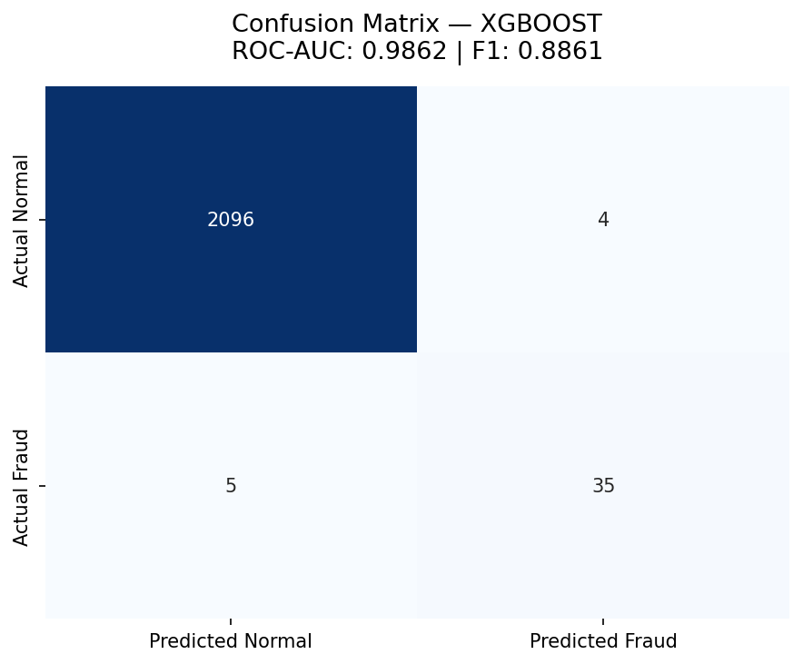
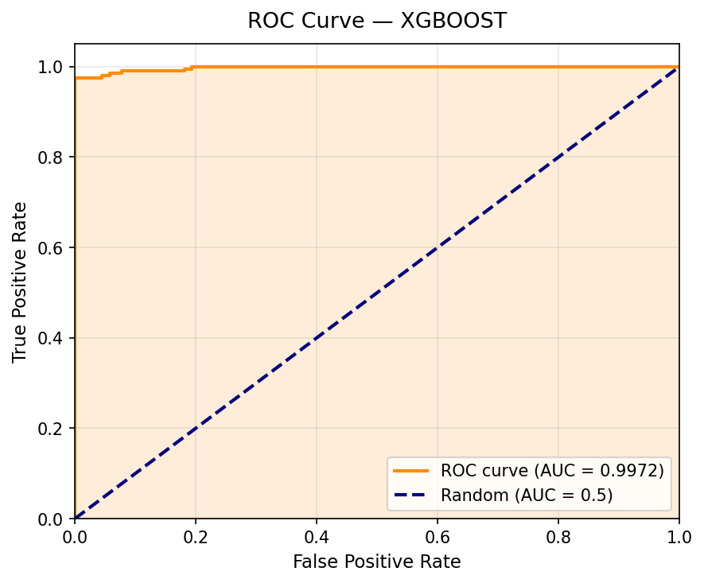
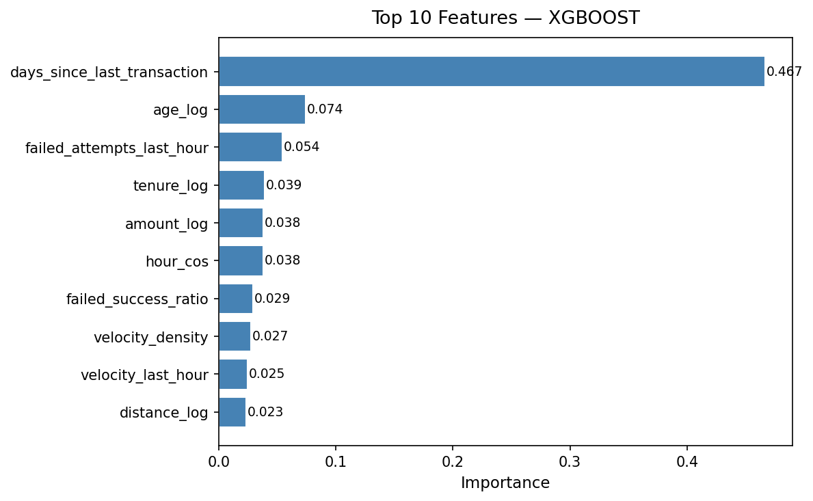

# FraudShield

Production-grade ML pipeline for fraud detection — synthetic data generation through model training, serving, monitoring, and automated retraining.

## Model Performance

| Model | ROC-AUC | Avg Precision | F1 (default) | F1 (tuned) | CV Mean ± Std |
|-------|---------|---------------|--------------|-------------|----------------|
| XGBoost | **0.9862** | 0.8976 | 0.8861 | **0.9333** | 0.9880 ± 0.0063 |
| CatBoost | **0.9841** | 0.8895 | 0.8642 | **0.9067** | 0.9856 ± 0.0056 |

<details>
<summary>Click to see evaluation charts</summary>

| Confusion Matrix | ROC Curve | Feature Importance |
|:-:|:-:|:-:|
|  |  |  |

</details>

## Architecture

```
data/generator.py         -- Synthetic transaction generator (5 fraud patterns + stealth)
       |
app/ml/features.py       -- Feature engineering (26 features)
app/ml/train.py          -- XGBoost / CatBoost + 5-fold CV + threshold tuning
       |
app/api/predict.py       -- FastAPI serving (single + batch inference)
app/monitoring/drift.py  -- PSI-based drift detection
app/monitoring/metrics.py -- Prometheus metrics
       |
pipelines/retrain_dag.py  -- Airflow DAG (weekly retraining)
pipelines/beam_pipeline.py -- Apache Beam streaming feature pipeline
```

## Quick Start

```bash
# Generate data & train
python -m data.generator
python -c "from app.ml.train import ModelTrainer; ModelTrainer('xgboost').train('data/synthetic/transactions.csv')"

# Serve API
uvicorn app.main:app --reload --port 8000

# Predict
curl -X POST http://localhost:8000/predict/single \
  -H "Content-Type: application/json" \
  -d '{"transaction_id":"txn_01","amount":250.00,"merchant_category":"retail","merchant_country":"US","card_present":true,"distance_from_home_km":5.0,"hour_of_day":14,"day_of_week":3,"days_since_last_transaction":2,"transactions_last_24h":3,"avg_transaction_amount_7d":75.0,"velocity_last_hour":1,"device_id":"d_iphone_01","ip_country_match":true,"card_type":"visa","age_days":365,"account_tenure_days":730,"failed_attempts_last_hour":0}'
```

<details>
<summary>API Response Example</summary>

```json
>>> curl http://localhost:8000/health
{
  "status": "healthy",
  "version": "1.0.0",
  "model_loaded": true,
  "model_type": "xgboost",
  "predictions_served": 0,
  "uptime": "2s"
}

>>> curl -X POST http://localhost:8000/predict/single -d '{...}'
{
  "transaction_id": "txn_demo_001",
  "is_fraud": true,
  "fraud_probability": 0.6034,
  "risk_level": "high",
  "model_version": "1.0.0",
  "processing_time_ms": 34.49
}
```
</details>

## Docker

```bash
docker compose up -d
# API:         http://localhost:8000
# MLflow:      http://localhost:5001
# Prometheus:  http://localhost:9090
# Grafana:     http://localhost:3001 (admin/admin)
```

## Synthetic Data

Generates ~10,700 transactions (200 fraudulent + 40 stealth) with 5 fraud patterns:

| Pattern | Signature |
|---------|-----------|
| Fast-Small-Staircase | Many small txns in rapid succession |
| Geographic Hop | Large amount, distant country, IP mismatch |
| Midnight Splash | High amount at odd hours (0-4am) |
| Card Testing | Repeated micro-txns, many failed attempts |
| Refund Cycle | Txn-refund pairs under real amounts |
| **Stealth Fraud** | Looks identical to normal — hardest to detect |

Noise injection (+15% gaussian) blurs fraud boundaries. False-alarm normals (5% of normal) mimic fraud signatures. This produces **realistic ROC-AUC ~0.98**, not perfect 1.0.

## API Endpoints

| Method | Path | Description |
|--------|------|-------------|
| GET | `/` | Service info |
| GET | `/health` | Health check with model status |
| POST | `/predict/single` | Single transaction prediction |
| POST | `/predict/batch` | Batch prediction (up to 1000) |
| GET | `/predict/drift` | Check feature drift |
| GET | `/predict/importance` | Top 20 feature importances |
| GET | `/predict/metrics` | Prometheus metrics |

## Tests

```bash
python -m pytest tests/ -v
```

23 tests covering: data generation, feature engineering, model training (XGBoost + CatBoost with CV), API endpoints, drift detection, Prometheus metrics.

## CI/CD

GitHub Actions runs on every push: `generate data → train XGBoost → train CatBoost → run 23 tests`.

## Monitoring

- **Drift Detection**: PSI-based per-feature distribution shift tracking
- **Prometheus Metrics**: request latency, fraud rate, prediction volume, model health
- **Grafana Dashboard**: visual monitoring (Docker Compose)
- **Drift History**: persisted to JSON for audit trail

## Pipeline Orchestration

- **Airflow DAG** (`pipelines/retrain_dag.py`): Weekly retrain — generate data, train XGBoost + CatBoost, evaluate and promote best model, update drift reference stats
- **Apache Beam** (`pipelines/beam_pipeline.py`): Streaming feature computation with sliding windows (1h window, 5min slide), device-level aggregation

## Project Structure

```
fraudshield/
  .github/workflows/ci.yml  -- GitHub Actions
  AGENTS.md                  -- Engineering rules for AI agents
  app/
    api/predict.py            -- Inference endpoints
    ml/features.py            -- 26 feature engineering
    ml/train.py               -- Training + 5-fold CV + threshold tuning
    monitoring/drift.py       -- PSI drift detection
    monitoring/metrics.py     -- Prometheus metrics
    config.py                 -- Settings
    main.py                   -- FastAPI app
    models.py                 -- Pydantic schemas
  data/
    generator.py              -- Synthetic data generator
  pipelines/
    retrain_dag.py            -- Airflow DAG
    beam_pipeline.py          -- Apache Beam pipeline
  scripts/
    generate_screenshots.py   -- Evaluation charts generator
  screenshots/                -- Confusion matrix, ROC, feature importance
  skills/                     -- 5 workflow skills (TDD, review, security, etc.)
  tests/                      -- 23 tests
  docker-compose.yml          -- API + MLflow + Prometheus + Grafana
  Dockerfile
  prometheus.yml
```
